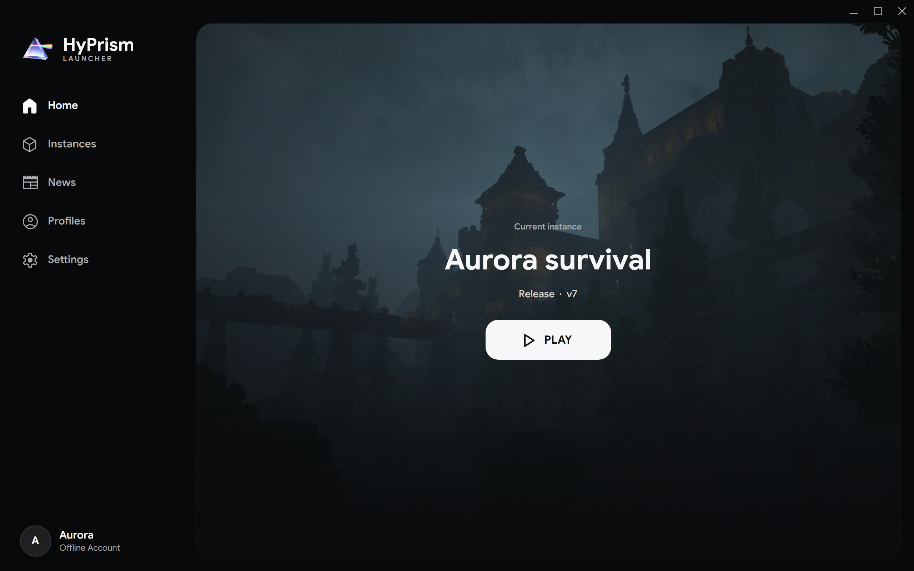

# Home

Home is the quickest way to start the current instance. It shows the instance name, branch, version, and one action that changes with its state

| Instance state | Home action |
| --- | --- |
| Not created | Opens **Instances** so you can create one |
| Not installed | Downloads the selected version, then launches it |
| Installed | Starts the game |
| Installing | Shows progress and can cancel the operation |
| Running | Stops that instance |

Installation and authentication errors appear in the launcher. Use the [instance console and logs](/docs/user-guide/instances-profiles-mods#console-and-logs) when the game starts but later fails

To change the background, open **Settings → Appearance** and select a fixed image or automatic rotation. See [Settings](/docs/user-guide/settings#appearance) for the related news option
