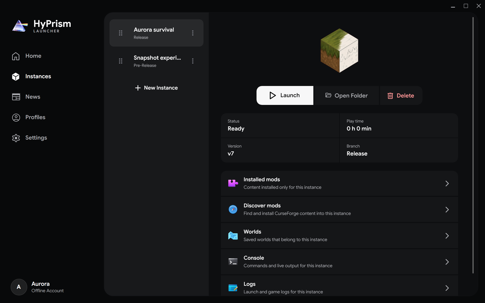

# Instances

An instance is one Hytale installation with its own version, game files, mods, worlds, console buffer, and play-time record

## Create an instance

1. Open **Instances** and select **New Instance**
2. Choose a branch
3. Choose one of the available versions
4. Confirm the creation

The new entry appears immediately, but its game files are downloaded only when you launch it

## Install or launch

Select an instance card, then use its main action

- An uninstalled instance downloads its files and starts automatically when installation succeeds
- An installed instance starts without downloading a complete image again
- A running instance shows its session time and the same action stops it
- An active installation can be canceled after the action changes to **Cancel**

Only one process can use an instance at a time. Different instances can run together because their files and user data are separate

## Manage files

**Open Folder** opens the instance directory. Use it only when no installation, update, or game process is writing to that instance

**Delete** removes the instance and its game data after confirmation. Back up worlds or other files you want to keep before deleting it

Dragging a card by its handle changes and saves the list order. Opening a card changes the workspace displayed on the right

## Instance sections

| Section | Use it for |
| --- | --- |
| **Installed mods** | Enable, disable, update, import, or remove mods in this instance |
| **Discover mods** | Find compatible CurseForge files and install them into this instance |
| **Worlds** | View saves found under the instance user data |
| **Console** | Follow live output from the running game |
| **Logs** | Not yet available; use the log files on disk |

See [Mods](/docs/user-guide/mods) for the complete mod workflow

## Console and logs {/* #console-and-logs */}

The console keeps a separate in-memory buffer for every instance while the launcher is open. You can filter text, pause automatic scrolling by scrolling away from the bottom, toggle line wrapping, and clear the visible buffer

Launcher logs remain on disk after HyPrism closes. Open **Settings → Data**, open the launcher data folder, and look in `Logs` for the relevant session. If a launch fails, include the relevant launcher and instance logs when [reporting a bug](https://github.com/hyprismteam/HyPrism/issues/new/choose), but review them for personal paths or account data first

## Running games after reopening HyPrism

HyPrism records game process identity and restores the running state when the same process is still alive after reopening the launcher. It removes stale records and keeps accumulated play time
