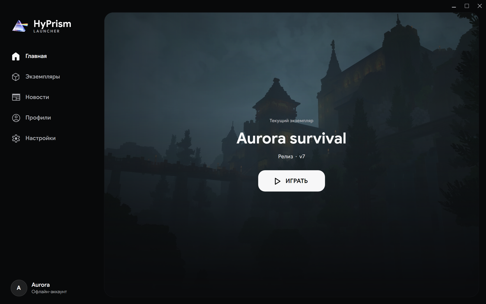

# Главная

Главная страница позволяет быстро запустить текущий экземпляр. Она показывает его имя, ветку, версию и одно действие, которое меняется вместе с состоянием

| Состояние экземпляра | Действие на Главной |
| --- | --- |
| Не создан | Открывает **Экземпляры** для создания |
| Не установлен | Загружает выбранную версию и запускает ее |
| Установлен | Запускает игру |
| Устанавливается | Показывает прогресс и позволяет отменить операцию |
| Запущен | Останавливает этот экземпляр |

Ошибки установки и аутентификации появляются в лаунчере. Если игра запустилась, но затем завершилась с ошибкой, откройте [консоль и логи экземпляра](/docs/user-guide/instances-profiles-mods#console-and-logs)

Чтобы сменить фон, откройте **Настройки → Внешний вид** и выберите изображение или автоматическую ротацию. Связанная настройка новостей описана на странице [Настройки](/docs/user-guide/settings#appearance)
