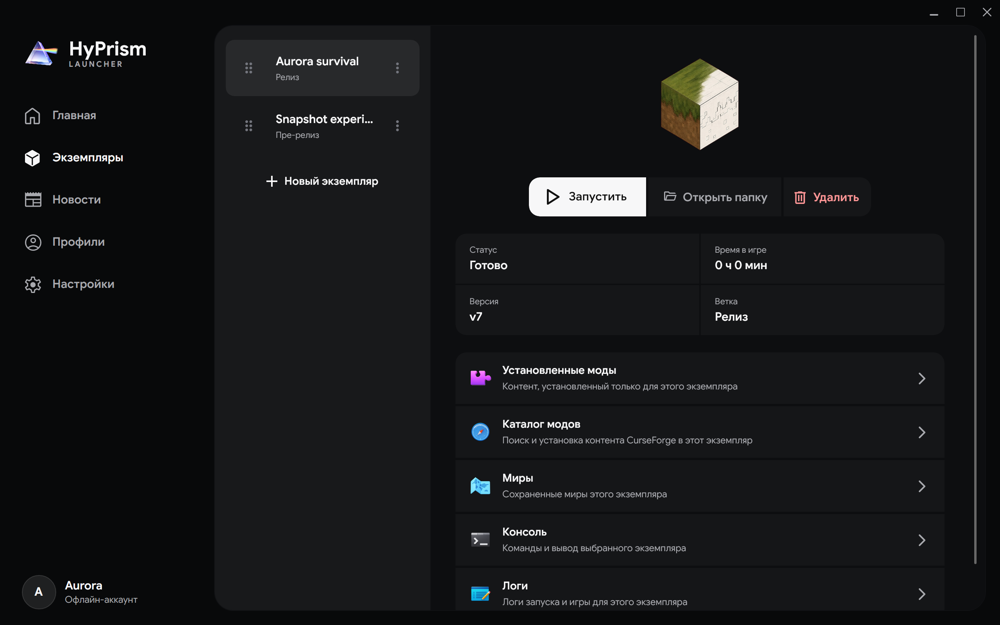

# Экземпляры

Экземпляр представляет собой отдельную установку Hytale со своей версией, файлами игры, модами, мирами, буфером консоли и счетчиком игрового времени

## Создание экземпляра

1. Откройте **Экземпляры** и нажмите **Новый экземпляр**
2. Выберите ветку
3. Выберите одну из доступных версий
4. Подтвердите создание

Новая запись появится сразу, но файлы игры будут загружены только при запуске

## Установка или запуск

Выберите карточку экземпляра и используйте основное действие

- Неустановленный экземпляр загружает файлы и автоматически запускается после успешной установки
- Установленный экземпляр запускается без повторной загрузки полного образа
- Запущенный экземпляр показывает время сессии, а та же кнопка останавливает его
- Активную установку можно отменить после того, как действие сменится на **Отмена**

Один экземпляр нельзя запустить дважды одновременно. Разные экземпляры могут работать параллельно, потому что их файлы и пользовательские данные разделены

## Управление файлами

**Открыть папку** открывает каталог экземпляра. Изменяйте его вручную, только когда установка, обновление и процесс игры не записывают туда данные

**Удалить** после подтверждения удаляет экземпляр вместе с игровыми данными. Заранее сохраните нужные миры и другие файлы

Перетаскивание карточки за маркер меняет и сохраняет порядок списка. Выбор карточки меняет экземпляр в рабочей области справа

## Разделы экземпляра

| Раздел | Назначение |
| --- | --- |
| **Установленные моды** | Включение, отключение, обновление, импорт и удаление модов |
| **Найти моды** | Поиск совместимых файлов CurseForge и установка в экземпляр |
| **Миры** | Просмотр сохранений в пользовательских данных экземпляра |
| **Консоль** | Просмотр вывода запущенной игры в реальном времени |
| **Логи** | Пока недоступен; используйте файлы логов на диске |

Полная работа с модами описана на странице [Моды](/docs/user-guide/mods)

## Консоль и логи {/* #console-and-logs */}

Пока лаунчер открыт, консоль хранит отдельный буфер для каждого экземпляра. Текст можно фильтровать, автоматическая прокрутка останавливается после прокрутки вверх, перенос строк переключается отдельно, а очистка удаляет видимый буфер

Логи лаунчера сохраняются на диске после закрытия HyPrism. В разделе **Настройки → Данные** откройте папку данных лаунчера и найдите нужную сессию в `Logs`. При [создании отчета об ошибке](https://github.com/hyprismteam/HyPrism/issues/new/choose) приложите логи лаунчера и экземпляра, но сначала проверьте их на наличие личных путей и данных учетной записи

## Запущенная игра после повторного открытия HyPrism

HyPrism сохраняет сведения о процессе игры и восстанавливает состояние запуска, если тот же процесс остается активным. Устаревшие записи удаляются, а накопленное игровое время сохраняется
