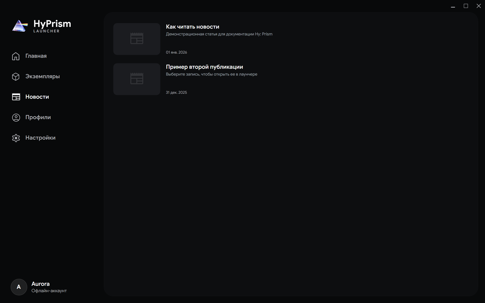
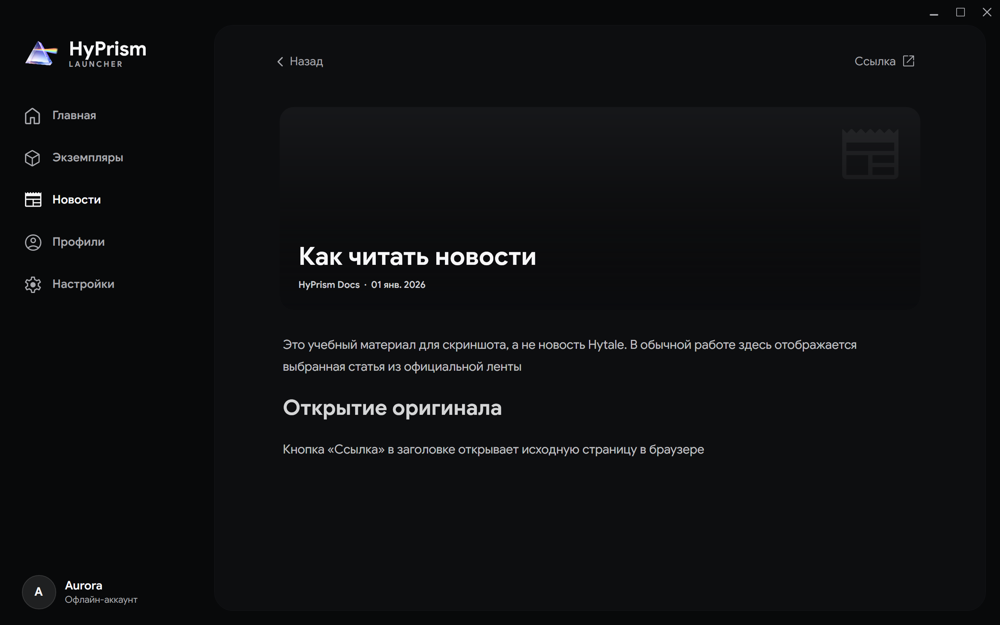

# Новости

Страница новостей загружает официальную ленту Hytale и открывает статьи внутри HyPrism

На скриншотах показаны учебные статьи для знакомства с интерфейсом, а не текущие объявления Hytale

## Чтение статьи

1. Откройте **Новости**
2. Выберите запись в ленте
3. Нажмите **Ссылка** в заголовке статьи, чтобы открыть исходную страницу в браузере
4. Нажмите **Загрузить еще** в конце ленты для получения старых публикаций

В компактном окне кнопка **Назад** возвращает из статьи к ленте

HyPrism кэширует разобранную ленту, открытые статьи и изображения. Недавно просмотренные материалы могут открываться при временном отсутствии сети

Параметр **Отключить новости** в разделе **Настройки → Внешний вид** пока не действует в текущей настольной версии
