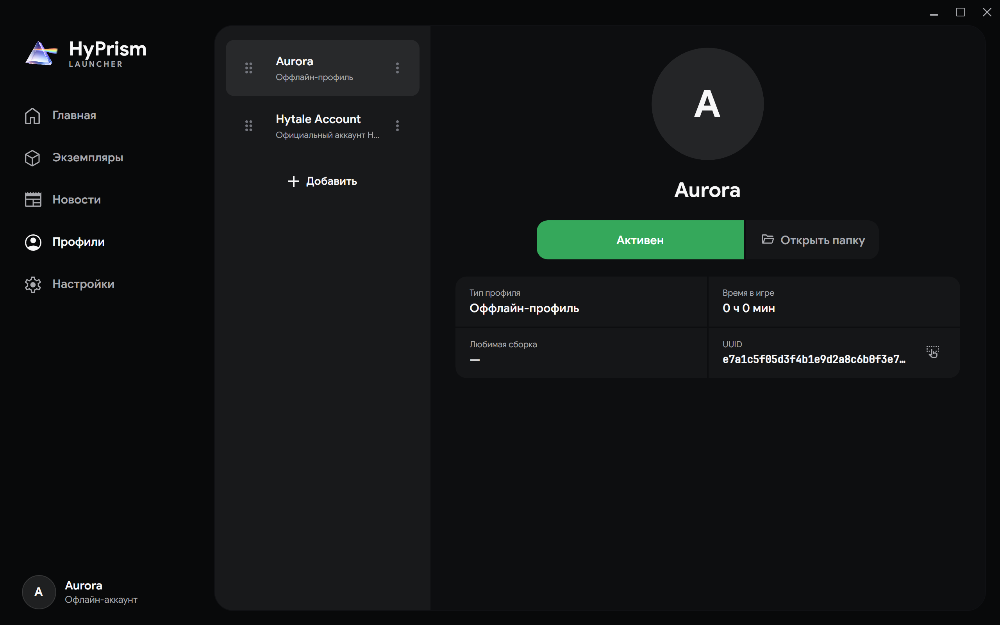

# Профили

Профиль определяет личность игрока, которую HyPrism использует при запуске экземпляра. Активный профиль показан внизу панели навигации

## Создание офлайн-профиля

1. Откройте **Профили** и нажмите **Добавить**
2. Выберите **Оффлайн-профиль**
3. Введите имя от 3 до 16 латинских букв, цифр, дефисов или символов подчеркивания
4. Создайте профиль

Офлайн-профиль может использовать сторонний сетевой сервис аутентификации или локальный [Local Node](/docs/reference/local-node). Такой профиль не получает официальную лицензию, облачную личность или централизованные социальные функции

## Добавление официального профиля

1. Откройте **Профили** и нажмите **Добавить**
2. Выберите **Официальный аккаунт Hytale**
3. Начните вход
4. Завершите авторизацию в системном браузере
5. Вернитесь в HyPrism после сообщения об успехе

HyPrism сохранит профили, возвращенные учетной записью, и при необходимости обновит сессию. Официальная загрузка и запуск игры требуют учетную запись с лицензией Hytale

## Выбор и управление профилями

- Выберите карточку, чтобы увидеть тип, игровое время, любимый экземпляр и UUID
- Нажмите **Выбрать**, чтобы использовать профиль для следующих запусков
- Используйте **Копировать UUID**, когда идентификатор нужен другому инструменту
- Нажмите **Открыть папку** для просмотра файлов профиля
- Откройте меню с тремя точками для дублирования или удаления; изменение доступно только для офлайн-профилей
- Перетащите маркер карточки, чтобы сохранить другой порядок профилей

Активный профиль нельзя удалить. Сначала выберите другой

:::warning
Не передавайте файлы сессии и токены из каталога профиля. Для отчета об ошибке обычно нужны логи лаунчера, а не учетные данные
:::
